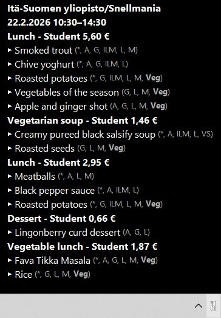

# Compass Lunch Plasmoid

System tray oriented KDE Plasma widget for Compass Group Kuopio lunch menus.

## Features

- Shows today's lunch in hover tooltip.
- Supports Snellmania, Canthia, Tietoteknia
- Language switch (`fi` / `en`) and configurable favorite restaurant.
- Mouse-wheel cycling on tray icon to switch restaurant instantly.
- Middle-click icon to open restaurant page.
- Automatic refresh

## Screenshot


## Install / Update / Remove

Check Plasma version:

```bash
plasmashell --version
```

Clone once:

```bash
git clone https://github.com/veetir/compass-lunch-plasmoid.git
cd compass-lunch-plasmoid
```

Install (Plasma 6):

```bash
kpackagetool6 -t Plasma/Applet -i "$PWD/plasma6"
```

Upgrade existing install:

```bash
git pull
kpackagetool6 -t Plasma/Applet -u "$PWD/plasma6"
```

Remove:

```bash
kpackagetool6 -t Plasma/Applet -r compass-lunch
```

On Plasma 5, run the same commands but use `kpackagetool5` and `"$PWD/plasma5"` instead.

## Windows version

See [Releases](https://github.com/veetir/compass-lunch-plasmoid/releases) for
exe downloads.

### Features
* Cycle between restaurants by clicking
* Run at startup 
* Dark/light mode
* Togglable allergens & prices

