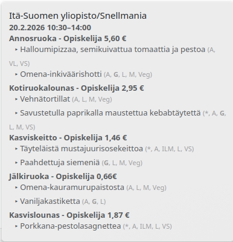
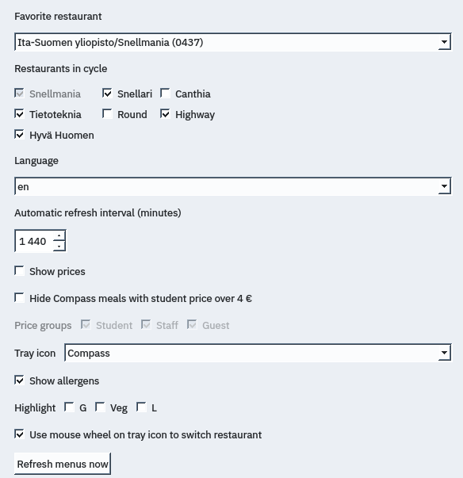
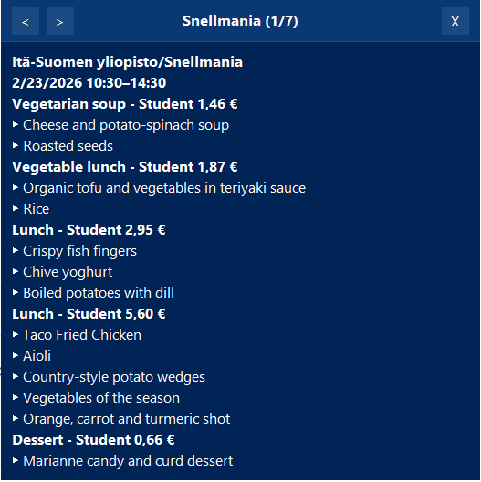

# Lunch Plasmoid

System tray KDE Plasma widget for UEF Kuopio lunch menus.

## Features

- Shows today's lunch in hover tooltip
- Supports 
    - Compass: Snellmania, Snellari, Canthia, Tietoteknia
    - Antell: Round, Highway
    - Hyvä Huomen: Bioteknia
- Language switch (`fi` / `en`)
- Configurable set of restaurants, favorite restaurant
- Mouse-wheel cycling on tray icon to switch restaurant instantly
- Middle-click icon to open restaurant web page
- Automatic and manual refresh

## Screenshot

<p>
  
  
</p>

## Install / Update / Remove

Check Plasma version:

```bash
plasmashell --version
```

Clone once:

```bash
git clone https://github.com/veetir/compass-lunch-plasmoid.git
cd compass-lunch-plasmoid
```

Install (Plasma 6):

```bash
kpackagetool6 -t Plasma/Applet -i "$PWD/plasma6"
```

Upgrade existing install:

```bash
git pull
kpackagetool6 -t Plasma/Applet -u "$PWD/plasma6"
```

Remove:

```bash
kpackagetool6 -t Plasma/Applet -r compass-lunch
```

On Plasma 5, run the same commands but use `kpackagetool5` and `"$PWD/plasma5"` instead.

## Windows version

See [Releases](https://github.com/veetir/compass-lunch-plasmoid/releases) for
exe downloads.

### Features
- Left-click tray icon to open/close the widget
- Navigate restaurants with header buttons, mouse wheel, or `Left/Right` (`A`/`D`)
- Toggle allergens, diet highlights, and price groups
- Themes: dark, light, blue, green
- Manual/automatic refresh with cache fallback
- Run at startup


