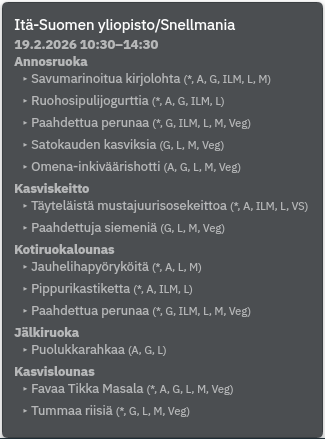

# Compass Lunch Plasmoid (Plasma 5)

System tray oriented KDE Plasma 5 widget for Compass Group Kuopio lunch menus.

## Features

- Shows today's lunch in hover tooltip.
- Supports Snellmania, Canthia, Tietoteknia
- Language switch (`fi` / `en`) and configurable favorite restaurant.
- Mouse-wheel cycling on tray icon to switch restaurant instantly.
- Middle-click icon to open restaurant page.
- Automatic refresh

## Screenshot



## Install / Update / Remove

Install:

```bash
git clone https://github.com/veetir/compass-lunch-plasmoid.git
cd compass-lunch-plasmoid
kpackagetool5 -t Plasma/Applet -i "$PWD"
```

Upgrade existing install:

```bash
git pull
kpackagetool5 -t Plasma/Applet -u "$PWD"
```

Remove:

```bash
kpackagetool5 -t Plasma/Applet -r compass-lunch
```
